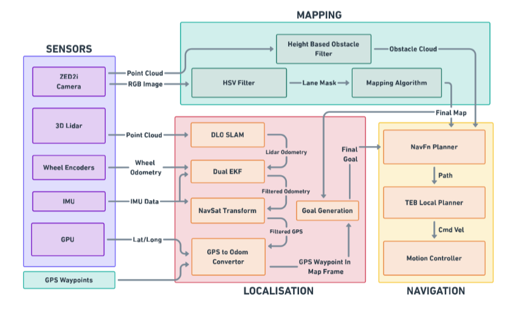

# Autonav Competition Stack for STEVE Bot

This is the official repository for the **Autonav Competition Stack** for **STEVE Bot**, developed by **Project Manas** from **Manipal Institute of Technology**. This stack was successfully deployed for the **Intelligent Ground Vehicle Competition (IGVC) 2025**.

The stack is built on **Ubuntu 20.04** and uses **ROS Noetic**.

---

## Overview

### Bot and Pipeline Overview

Below are side-by-side images of the bot **STEVE** and the stack pipeline:

| STEVE Bot                      | Stack Pipeline                         |
| ------------------------------ | -------------------------------------- |
|  |  |

---

## Sensors

The stack integrates a variety of advanced sensors for navigation and mapping:

1. **ZED2i Camera**:
   - Used for lane detection and obstacle identification.
2. **Ouster OS1 LIDAR**:
   - Provides 3D point cloud data for obstacle detection and provide odometry.
3. **GPS (WIT)**:
   - Supplies GPS waypoints for global navigation.
4. **IMU (CUAV)**:
   - Provides orientation and motion data for smooth navigation.

---

## Package Documentation

Each package in the stack has detailed documentation within its respective folder.

---

## Getting Started

1. Clone the repository:
   ```bash
   git clone git@github.com:asmit-mit/autonav-ws.git
   ```
2. Navigate build and source:
   ```bash
   cd autonav-ws
   catkin_make
   source devel/setup.bash
   ```
3. Launch the stack:
   ```bash
   roslaunch launcher sb.launch
   ```
